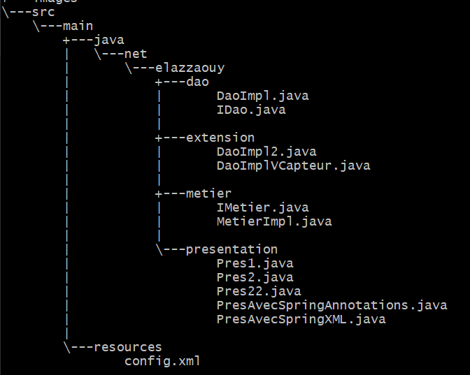
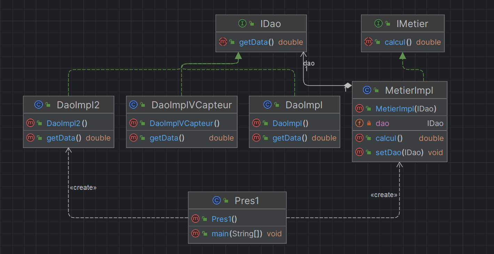
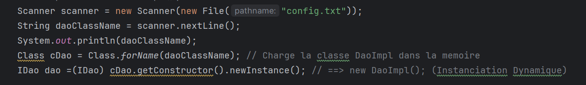
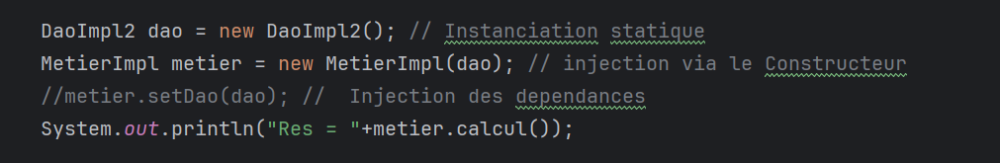
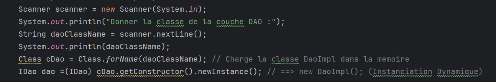
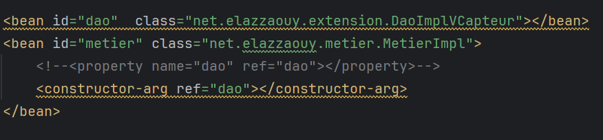

# Spring IoC-DI Project

## Overview

This project demonstrates the concepts of Inversion of Control (**IoC**), Dependency Injection (**DI**), and low coupling using dynamic and static instantiation in a Spring-based **Java** application. It explores the integration of Spring annotations (`@Component`, `@Repository`, `@Service`) and **XML** configuration for **IoC** and **DI**.

## Table of Contents

- [Getting Started](#getting-started)
- [Project Structure](#project-structure)
- [Dependencies](#dependencies)
- [Usage](#usage)
    - [Dynamic Instantiation](#dynamic-instantiation)
    - [Static Instantiation](#static-instantiation)
    - [Keyboard Input](#keyboard-input)
    - [XML Configuration (springContext)](#xml-configuration-springcontext)
    - [Annotations (springAnnotation)](#annotations-springannotation)
- [Examples](#examples)
- [Contributing](#contributing)

## Getting Started

To get started, clone the repository and follow these steps:

```bash
git clone https://github.com/MED-ELAZZAOUY/IOC-DI-Spring.git
cd project-directory
```
## Project Structure

The project structure consists of the following key packages and classes:





## Dependencies

The project relies on the following dependencies:

```bash
dependencies>
    <!-- https://mvnrepository.com/artifact/org.springframework/spring-core -->
        <dependency>
            <groupId>org.springframework</groupId>
            <artifactId>spring-core</artifactId>
            <version>5.3.31</version>
        </dependency>

        <!-- https://mvnrepository.com/artifact/org.springframework/spring-context -->
        <dependency>
            <groupId>org.springframework</groupId>
            <artifactId>spring-context</artifactId>
            <version>5.3.31</version>
        </dependency>

        <!-- https://mvnrepository.com/artifact/org.springframework/spring-beans -->
        <dependency>
            <groupId>org.springframework</groupId>
            <artifactId>spring-beans</artifactId>
            <version>5.3.31</version>
        </dependency>

    </dependencies>
```

## Usage

# Dynamic Instantiation

For dynamic instantiation, the project uses reflection to load classes dynamically based on input from a configuration file or user input.
// Example usage in **Pres2.java**



# Static Instantiation

Static instantiation involves creating instances of classes directly in the code.
// Example usage in **Pres1.java**.



# Keyboard Input

The project allows users to input class names dynamically through the keyboard.
// Example usage in **Pres22.java**.



# XML Configuration (springContext)

IoC and DI are also achieved through XML configuration.
//Example configuration in **config.xml**



# Annotations (springAnnotation)

Annotations such as **@Repository**, **@Service** and **@Component** are used to mark classes as components for IoC and DI.

## Examples

The project includes various examples showcasing different **instantiation** methods and **configurations**. See the **Pres1.java**, **Pres2.java**, **Pres22.java**, **PresAvecSpringAnnotations.java**, and **PresAvecSpringXML.java** classes for detailed examples.

## Contributing

**Contributions** are **welcome!** To contribute, follow these steps:
```bash
# How to Contribute

1. Fork the repository
2. Create a new branch
3. Make your changes
4. Open a pull request
```
